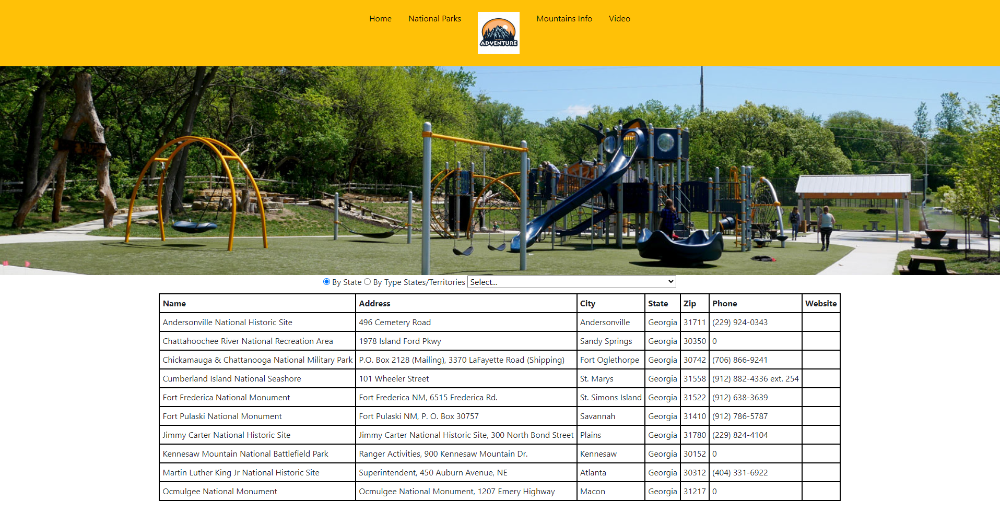
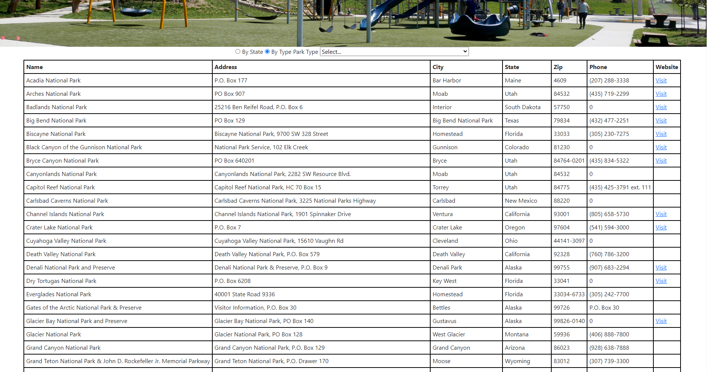
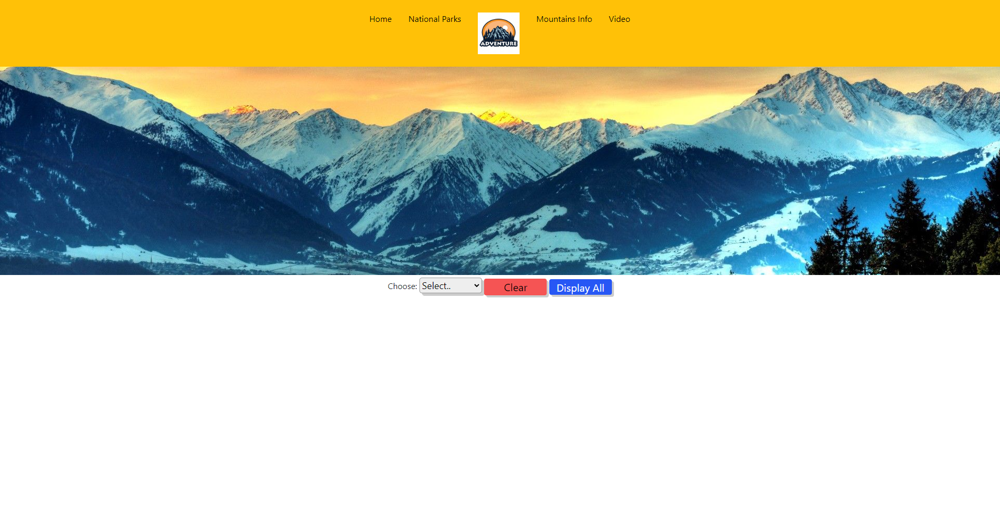
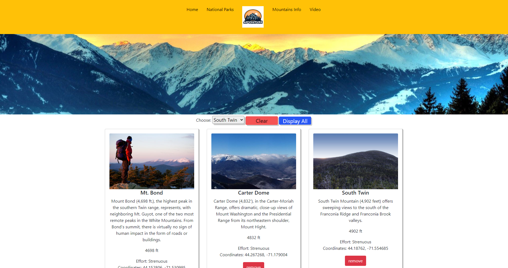
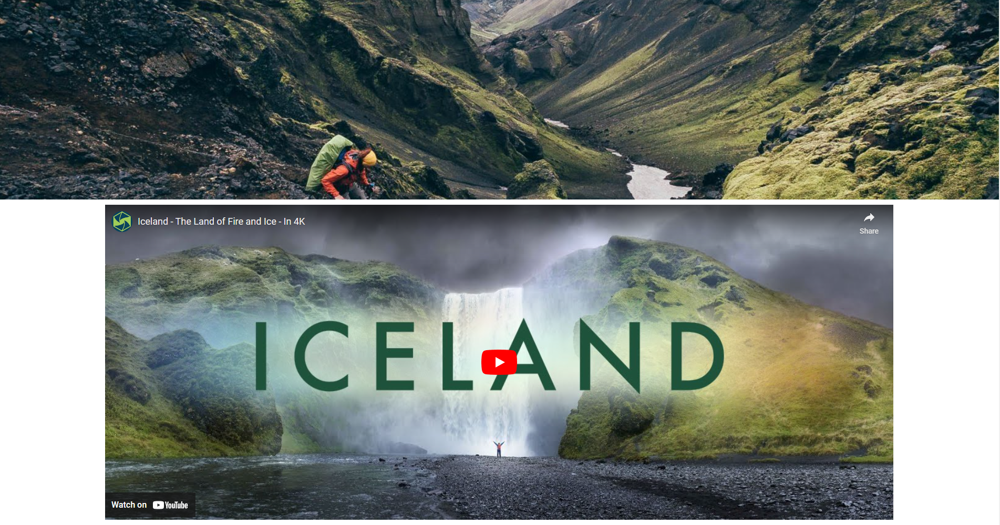

# Enjoy-the-Outdoors
Website that specializes in finding national parks, and mountains to climb. Using my knowledge of HTML, CSS, and JavaScript.

Working on this function was honestly the best part of this project, looking up on how to implment the code together
Creating a function in JavaScript that created a bootstrap5 card. Connecting the lines from HTML => JavaScript and appending it to HTML
was something that did a bring a smile to my face.
